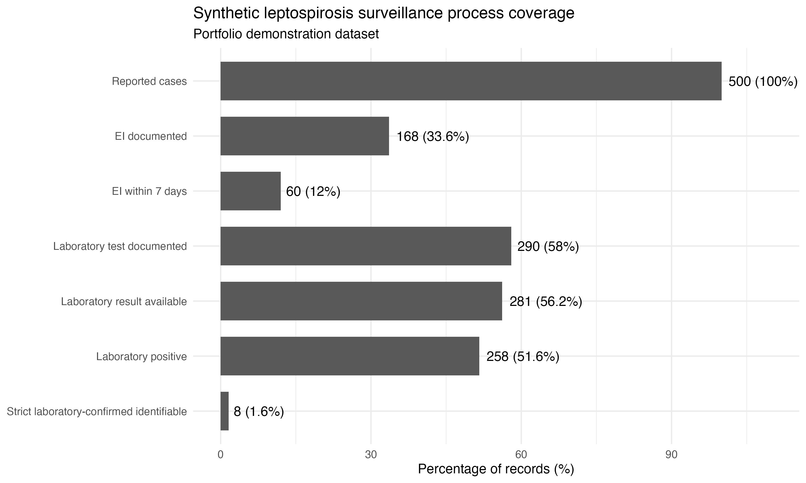
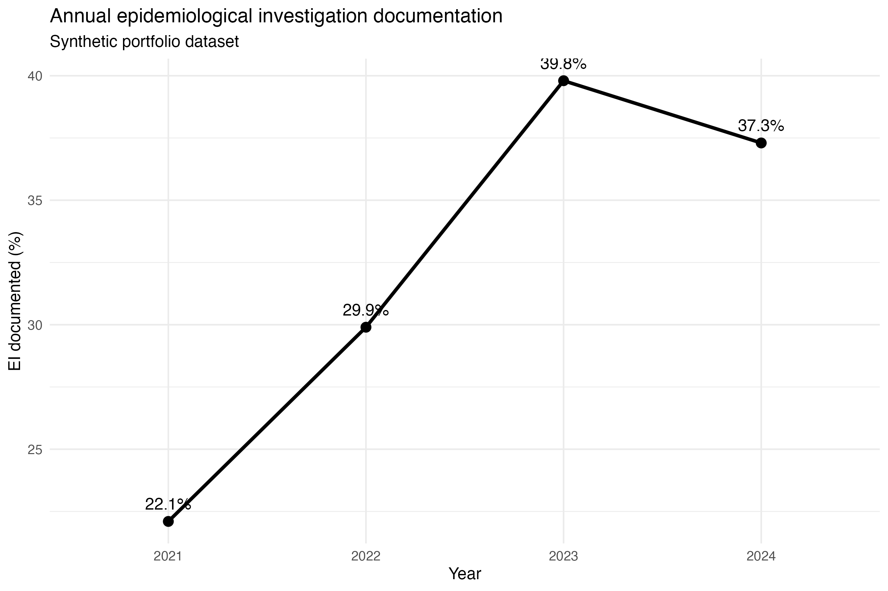
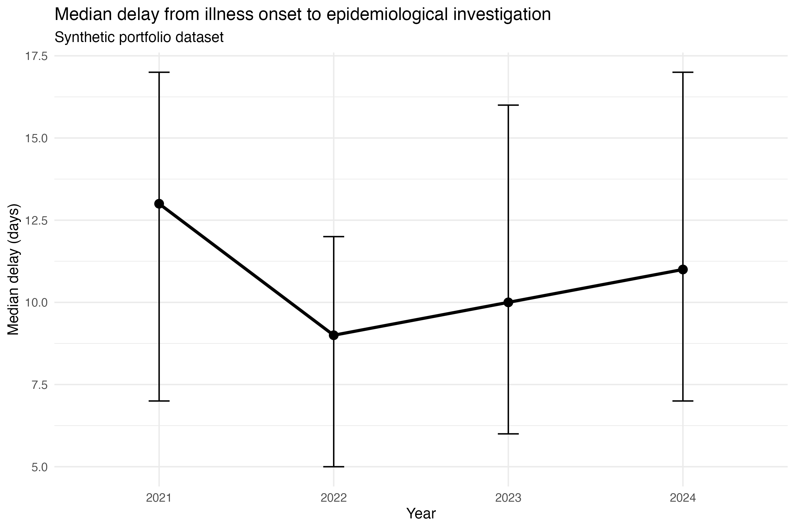

# Leptospirosis Surveillance Analytics

**Synthetic Public Health Data Project | R | Epidemiology | Surveillance Analytics**

An end-to-end infectious disease surveillance analytics project demonstrating how routine surveillance data can be transformed into actionable public health indicators using R.

> **Privacy note:** This project uses fully synthetic data. No real patient-level, health facility, or government surveillance records are included.

---

## Project Overview

This portfolio project simulates a routine leptospirosis surveillance workflow commonly encountered in field epidemiology and public health practice.

The analysis focuses on:

- epidemiological investigation completeness;
- onset-to-investigation delay;
- laboratory testing completeness;
- annual surveillance trends;
- multivariable logistic regression; and
- reproducible data visualization.

---

## What I Did

- Built surveillance completeness indicators
- Assessed epidemiological investigation performance
- Analyzed onset-to-investigation delay
- Evaluated laboratory testing completeness
- Developed multivariable logistic regression models
- Generated reproducible analytical outputs
- Produced publication-ready visualizations

---

## Dataset

The analysis uses **500 fully synthetic leptospirosis surveillance records**.

Variables include:

- case identifier
- illness-onset year
- age
- sex
- first facility type
- epidemiological investigation documentation
- investigation date documentation
- onset-to-investigation delay
- investigation within 7 days
- laboratory testing
- laboratory result availability
- laboratory positivity
- strict laboratory-confirmation indicator
- final outcome

### Data Privacy

This repository contains **no real patient-level information**.

No original surveillance data, personal identifiers, health facility records, or confidential government data are included.

---

## Analytical Workflow

1. Import synthetic surveillance data
2. Perform data-quality checks
3. Construct surveillance indicators
4. Summarize annual surveillance performance
5. Describe onset-to-investigation delay
6. Fit multivariable logistic regression models
7. Generate analytical figures
8. Export reproducible outputs

---

## Statistical Analysis

Multivariable logistic regression was used to assess factors associated with:

- documented epidemiological investigation; and
- documented laboratory testing.

Covariates included:

- age;
- sex;
- illness-onset year; and
- first facility type.

Adjusted odds ratios and 95% confidence intervals were calculated.

All numerical results in this repository are based on synthetic data and are intended for demonstration only.

---

## Key Visualizations

### Surveillance Process Coverage



### Annual Epidemiological Investigation Documentation



### Median Onset-to-Investigation Delay



---

## Repository Structure

```text
portfolio_leptospirosis/
├── README.md
├── data/
│   └── synthetic_leptospirosis_surveillance.csv
├── R/
│   └── portfolio_analysis.R
├── figures/
│   ├── figure1_surveillance_coverage.png
│   ├── figure2_annual_ei.png
│   └── figure3_ei_delay.png
└── outputs/
    ├── summary_indicators.csv
    ├── annual_surveillance_indicators.csv
    ├── ei_regression_results.csv
    └── lab_regression_results.csv
```

---

## Tools and Skills

### Technical

- R
- ggplot2
- data validation
- descriptive epidemiology
- logistic regression
- confidence interval estimation
- data visualization
- reproducible analysis

### Public Health

- infectious disease surveillance
- field epidemiology
- surveillance-system assessment
- epidemiological investigation
- laboratory data assessment
- translation of analytical findings into public health insights

---

## How to Run

Open:

```text
R/portfolio_analysis.R
```

Set the working directory to the `R` folder and run the script from top to bottom.

The script reads:

```text
../data/synthetic_leptospirosis_surveillance.csv
```

and automatically generates figures and analytical outputs.

---

## Disclaimer

This is a synthetic portfolio project.

It does not reproduce or disclose findings from any real surveillance database, patient record, health facility, or government dataset.

All numerical results are generated from simulated data and should be interpreted only for demonstration purposes.

---

## Author

**Nilna Sa'adatar Rohmah**

Field Epidemiology | Infectious Disease Surveillance | Public Health Data Analytics
